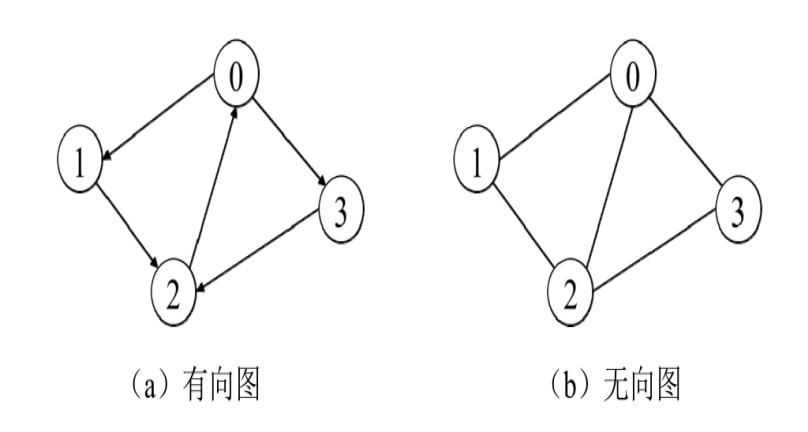
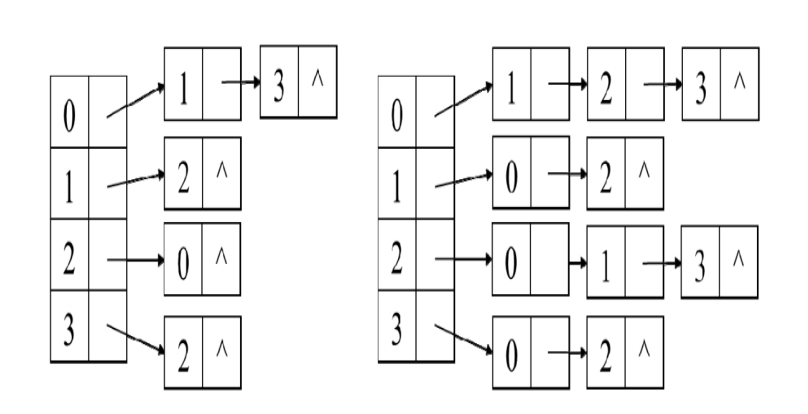
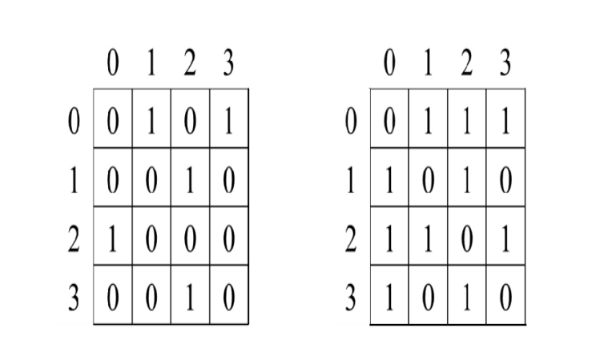
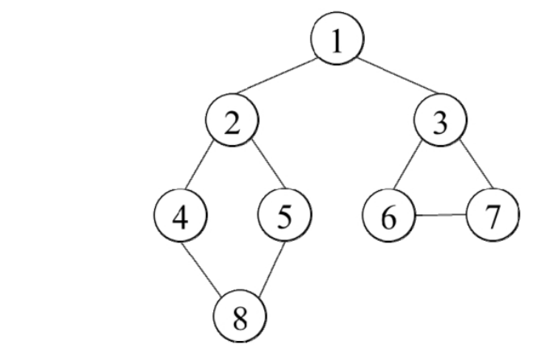
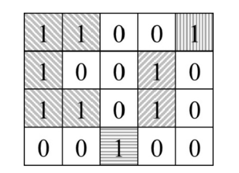
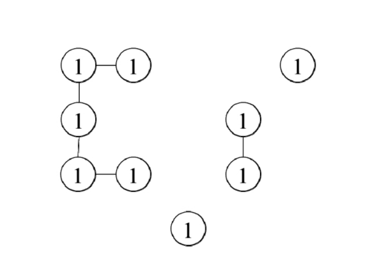

# 06 栈

后入先出

单调栈：

- 栈中的数据可能是排序的，使用排序的栈可以解决一些问题。

# 15 图

图：

- 节点
- 边

有向图，无向图

通常，图可以使用邻接表或邻接矩阵表示。

- 邻接表：为每个节点创建一个容器，存放所有与该节点相邻的节点

- 临接矩阵：如果节点个数为n，那么邻接矩M阵的大小为n*n
  
  - M[i][j] = 0/1,取决于是否相邻

有权图，无权图

## 图的搜索

图的搜索中，如何找出一条从起始节点到目标节点的路径或遍历所有节点，是与图相关的重要的算法

### BFS

Breadth-First-Search

1. 将起始节点加入队列
2. 每次从队列取出一个节点，然后将与该节点相邻并且之前还没有达到过的节点添加到队列中。
3. 重复该过程知道搜索完毕

如下，该图结构

依据BFS算法进行遍历

1 >> 2,3 >> 4,5 >> 6,7 >> 8

**广度优先搜索能够保证在无权图中，从某个起始节点出发最短距离到达目标节点。（无权图中，距离是连接两个节点的路径经过的节点的数目）**

### DFS

Depth-First Search

沿着边尽可能深入的探索

1. 将某个起始节点开始

2. 访问任一相邻且未访问过的节点

3. 递归上面过程，如果均已访问过，那么回溯

1 >> 2 >> 4 >> 8 >> 5 >> 3 >> 6 >> 7

树是无环的，但是图可能有。一定要避免程序不会因为沿着环的边不断的在环中搜索而陷入死循环。

- 可使用记录已经搜索过的节点，避免重复访问

不管DFS还是BFS，都只会访问一次节点。因此对于一个有v个节点以及e条边的图搜索，时间复杂度是O(v+e)

### 面试题

0x01 最大的岛屿

> 海洋岛屿地图可以用由0、1组成的二维数组表示，水平或竖直方向相连的一组1表示一个岛屿，请计算最大的岛屿的面积（即岛屿中1的数目）。例如，在图15.5中有4个岛屿，其中最大的岛屿的面积为5。

可以用下面的图来表示该岛屿

此时目标就变成了如下

- 计算出每个连通子图的节点的数目

- 返回其中最大的

